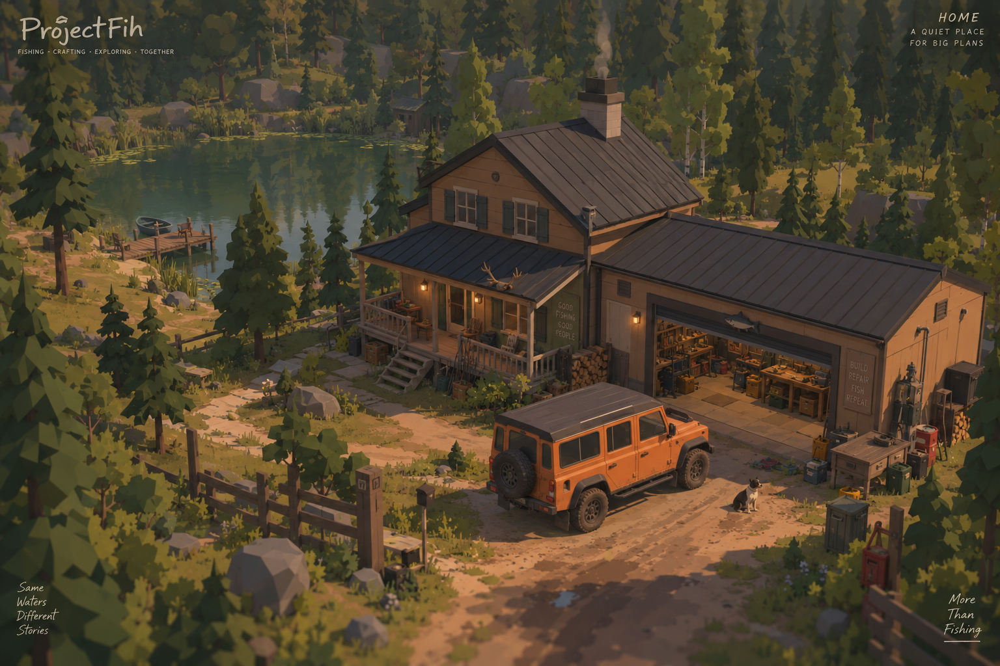
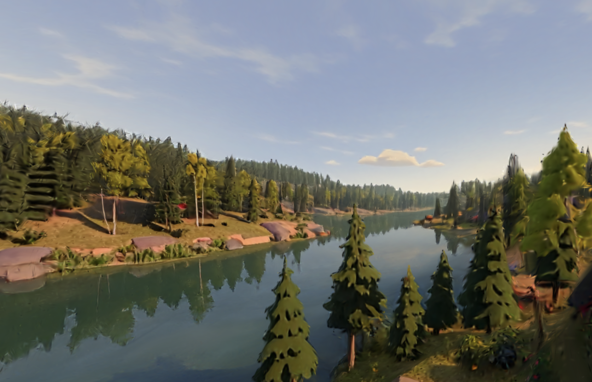

# ProjectFih 🎣

**ProjectFih** — мой игровой проект на Unity 6: рыболовный sandbox с крафтом, исследованием и упором на создание собственных снастей и приманок.

  

> Рыбалка • Крафт • Исследование • Совместная игра

---

## О проекте

Идея ProjectFih — сделать игру о рыбалке, в которой игрок не просто покупает готовые снасти, а может экспериментировать с ними и постепенно создавать собственное оборудование.

По сюжету игрок приезжает к загородному дому деда, который раньше увлекался рыбалкой и самостоятельно делал приманки и снасти.

Старая мастерская становится основной базой игрока: здесь в дальнейшем можно будет создавать приманки, собирать снасти, тестировать их и постепенно улучшать оборудование.

В будущем игра планируется как **кооперативный sandbox для небольшой группы игроков**.

---

## Что уже работает

Текущий прототип сделан на **Unity 6 + URP**.

На данный момент реализованы:

- управление персонажем;
- управление камерой;
- заброс приманки;
- заряд силы заброса;
- физический полёт приманки через Rigidbody;
- подмотка приманки;
- динамическая леска между удилищем и приманкой;
- визуальный провис лески;
- уменьшение провиса при подмотке;
- небольшой асимметричный пруд;
- пологий берег и подход к воде;
- подготовленная зона под будущий дом, мастерскую и пирс;
- автоматическая настройка частей сцены через собственные инструменты Unity Editor;
- автоматическая проверка некоторых систем в Play Mode.

### Заброс и леска

  

---

## Визуальное направление

ProjectFih развивается в стиле:

**стилизованный low-poly / полу-реалистичный**

Основные принципы:

- простые и хорошо читаемые формы;
- гранёная геометрия;
- естественные пропорции;
- тёплое освещение;
- природные цвета;
- узнаваемые виды рыб;
- спокойная атмосфера загородной рыбалки.

  

Изображения выше показывают **визуальное направление проекта**, а не финальные игровые модели.

---

## Что планируется

### Рыбалка

Планируются три основных способа ловли:

- спиннинг;
- поплавочная ловля;
- фидерная ловля.

В дальнейшем система рыбалки должна учитывать:

- поведение приманки;
- скорость проводки;
- глубину;
- погоду;
- прозрачность воды;
- активность рыбы.

### Поведение рыбы

Рыба должна существовать в водоёме независимо от момента поклёвки.

Планируется система состояний:

`покой → интерес → сопровождение → погоня → атака → вываживание`

Отдельные рыбы смогут иметь собственный размер, вес, характер и идентификатор.

### Крафт

Одна из основных будущих механик — создание собственных приманок.

Игрок сможет менять:

- форму корпуса;
- материал;
- размер;
- расположение грузов;
- крючки;
- лопатку воблера;
- окраску.

Поведение приманки будет зависеть от её физических характеристик, а не только от заранее заданного параметра «качества».

---

## Работа с 3D и AI

Для прототипирования 3D-моделей я использую **Mint.gg**.

  

Mint.gg используется для:

- создания и поиска формы моделей рыб;
- прототипирования объектов окружения;
- экспериментов с визуальным стилем;
- подготовки моделей для дальнейшей интеграции в Unity.

Мой процесс выглядит примерно так:

**идея → визуальный концепт → 3D-прототип → отбор и доработка → Unity → проверка в игре**

---

## Технологии и инструменты

### Разработка

- Unity 6
- Universal Render Pipeline
- C#
- Unity Input System
- Rigidbody
- CharacterController
- LineRenderer
- Git
- GitHub

### AI-инструменты

- ChatGPT
- Codex / Work
- Ollama
- локальные языковые модели
- OpenCode
- Mint.gg

---

## KAI Studio

Для управления локальными AI-агентами я также сделал собственную веб-панель **KAI Studio**.

Она позволяет:

- создавать задачи;
- отправлять их агентам;
- видеть очередь выполнения;
- получать отчёты;
- видеть результат проверки;
- контролировать работу с телефона.

---

## Моя роль

В ProjectFih я совмещаю:

**геймдизайн / продуктовый дизайн / AI-assisted разработку**

Я отвечаю за:

- концепцию игры;
- игровые механики;
- направление физики;
- визуальный стиль;
- крафт;
- развитие игрока;
- структуру игровых систем;
- постановку задач AI-агентам;
- проверку результата;
- направление дальнейшей разработки.

Моя цель — использовать AI для автоматизации технической рутины и больше времени уделять механикам, игровому опыту и визуальному направлению проекта.

---

📖 [Подробное описание проекта → README_FULL.md](README_FULL.md)
